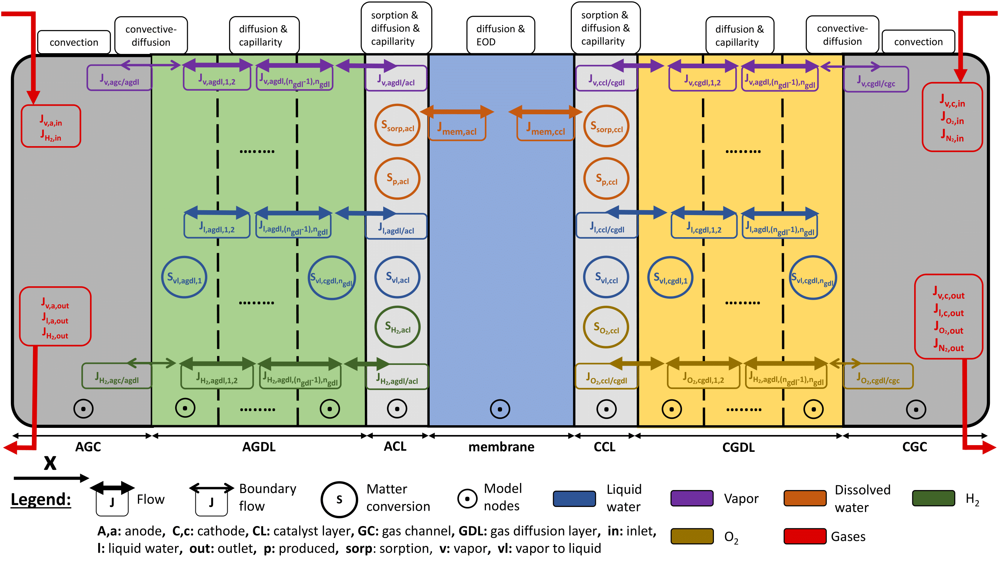

# AlphaPEM

AlphaPEM is an open-source software package for simulating proton exchange membrane fuel cell (PEMFC) systems for embedded applications. It is based on a physics-based, one-dimensional (1D), dynamic, two-phase, and isothermal model. It quickly simulates the internal states and voltage dynamics of PEMFC systems for all current densities and operating conditions imposed on it. In particular, it is possible to apply a step current density or use current profiles to generate polarization curves or electrochemical impedance spectroscopy (EIS) curves. It can also automatically calibrate the undetermined parameters of the model to simulate a given real fuel cell system.

A detailed [presentation](https://doi.org/10.48550/arXiv.2407.12373) of this program is currently under publication in the peer-reviewed journal SoftwareX. Furthermore, comprehensive [documentation](https://gassraphael.github.io/AlphaPEM/) in Numpy style for the software functions is available.

Improvements to **AlphaPEM**, such as the addition of heat transfer modelling and spatial extension to 1D+1D, will be available in the future.

")

# Table of Contents

- [Installation](#installation)
- [Major updates](#major-updates)
- [Related publications](#related-publications) 
- [Contributions](#contributions)
- [Contact](#contact)


# Installation

To install **AlphaPEM**, follow these steps in a shell:

1. Clone the repository:
    ```sh
    git clone https://github.com/gassraphael/AlphaPEM.git
    ```

2. Navigate to the project directory:
    ```sh
    cd AlphaPEM
    ```
    
3. Update the Python package manager, pip, to the latest available version:
    ```sh
    pip install --upgrade pip
    ```

4. Install the required dependencies (eventually in a specific environment):
    ```sh
    pip install numpy scipy matplotlib colorama geneticalgorithm2
    python3 -m pip install git+https://github.com/RedFantom/ttkthemes
    ```
    

# Major updates

- V1.0 - 2024.09.05 - This version of AlphaPEM corresponds to the one developed during Raphaël Gass's PhD from 2021 to 2024.


# Related publications

The detailed model description and simulation results can be found in the following articles and thesis.
	
- Published journal papers:
	- **AlphaPEM: An Open-Source Dynamic 1D Physics-Based Pem Fuel Cell Model for Embedded Applications** (1st author)
	    - In the [SoftwareX](https://doi.org/10.1016/j.softx.2024.102002) journal, in [arXiv](https://doi.org/10.48550/arXiv.2407.12373), in [HAL](https://hal.science/hal-04647829) or in [SSRN](http://ssrn.com/abstract=4946674) (postprint).
	    - The objective of this work is to highlight the AlphaPEM software, which has been published as open-source on GitHub. The first version of this PEM fuel cell simulator is based on the dynamic 1D model developed during 2021-2024. 

	- **An Advanced 1D Physics-Based Model for PEM Hydrogen Fuel Cells With Enhanced Overvoltage Prediction** (1st author)
		- In the [International Journal of Hydrogen Energy](https://doi.org/10.1016/j.ijhydene.2024.11.374), in [arXiv](https://doi.org/10.48550/arXiv.2404.07508), in [HAL](https://hal.science/hal-04530852) or in [SSRN](https://papers.ssrn.com/sol3/papers.cfm?abstract_id=4812343) (postprint).
		- The aim of this study was to introduce the dynamic 1D model developed during 2021-2024, emphasizing the adjustment of the equations for this specific model and their numerical resolution. Furthermore, a novel coefficient is proposed to establish a physical relationship between the voltage drop at high currents, the quantity of liquid water in the cell, and operating conditions.
		- 
		
	
	- **A Critical Review of Proton Exchange Membrane Fuel Cells Matter Transports and Voltage Polarisation for Modelling**
		- In the [Journal of the Electrochemical Society](https://doi.org/10.1149/1945-7111/ad305a) or in [HAL](https://hal.science/hal-04493419) (postprint).
		- The aim of this work was to compile, within a single article, all the equations required for the physical modeling of a fuel cell. Each equation is complemented with explanations, critical analysis, and suggestions for potential enhancements.
		
- Thesis:
	- to complete.


# Contributions

## Authors

AlphaPEM is firstly developed by [Raphaël Gass](https://gassraphael.github.io/) during his PhD thesis from 2021 to 2024, supervised by Prof. Zhongliang Li, Prof. Rachid Outbib, Prof. Samir Jemei and Prof. Daniel Hissel.
    
## Financial support

This work has been supported:

- from 2021 to 2024 by French National Research Agency via project [DEAL](https://deal.lis-lab.fr/) (Grant no. ANR-20-CE05-0016-01), the Region Provence-Alpes-Côte d’Azur, the EIPHI Graduate School (contract ANR-17-EURE-0002) and the Region Bourgogne Franche-Comté.

## Licenses

**AlphaPEM** is licensed under the GNU GPL 3.0. See the [LICENSE](LICENSE) file for more details. 

It also includes components licensed under the [MIT license](calibration/LICENSE-MIT):

- calibration/parameter_calibration.py from [geneticalgorithm2](https://github.com/PasaOpasen/geneticalgorithm2). 

## New contributors

Contributions from the community are welcome! If you would like to contribute to **AlphaPEM**, please follow these steps:

1. Fork the repository.
2. Create a new branch (`git checkout -b feature/YourFeature`).
3. Commit your changes (`git commit -am 'Add some feature'`).
4. Push to the branch (`git push origin feature/YourFeature`).
5. Create a new Pull Request.


# Contact

For any questions or support, please contact me at [gassraphael@proton.me](mailto:gassraphael@proton.me).

Thank you for using **AlphaPEM**!

