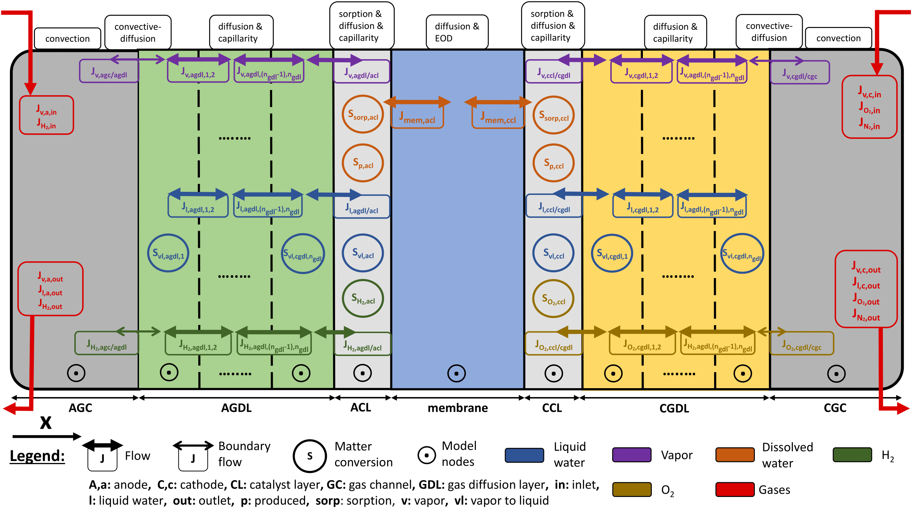

# AlphaPEM

AlphaPEM is an open-source software package for simulating proton exchange membrane fuel cell (PEMFC) systems for 
embedded applications written in Julia. It is based on a physics-based, finite-volume, pseudo-two-dimensional (1D+1D),
dynamic, two-phase, and non-isothermal model. It quickly simulates the internal states and voltage dynamics of PEMFC
systems for all current densities and operating conditions imposed on it. In particular, it is possible to apply a 
step current density or use current profiles to generate polarization curves or electrochemical impedance spectroscopy
(EIS) curves. It can also automatically calibrate the undetermined parameters of the model to simulate a given real 
fuel cell system.

A detailed [presentation](https://doi.org/10.48550/arXiv.2407.12373) of this program has been published in the peer-reviewed journal SoftwareX (limited to 
[version V1.0](#major-updates)). Furthermore, comprehensive [documentation](https://gassraphael.github.io/AlphaPEM/) in Numpy style for the software functions is
available.

Improvements to AlphaPEM are discussed in the [roadmap section](#roadmap).

**Important note:** AlphaPEM is an ongoing research project and is not a commercial product. Therefore, the latest 
online version may contain bugs, and not all features may be available. The current work is detailled in the 
[work in progress](#work-in-progress) section. Relatively stable versions are listed in the [Major updates](#major-updates) section.

")

# Table of Contents

- [Installation](#installation)
- [Start](#start)
- [Major updates](#major-updates)
- [Work in progress](#work-in-progress)
- [Roadmap](#roadmap)
- [Related publications](#related-publications) 
- [Contributions](#contributions)
- [Contact](#contact)


# Installation

## Installation from source (to develop AlphaPEM locally)

To install **AlphaPEM**, follow these steps in a shell:

1. Clone the repository:
    ```sh
    git clone https://github.com/gassraphael/AlphaPEM.git
    ```

2. Navigate to the project directory:
    ```sh
    cd AlphaPEM
    ```
    
3. Install Julia (using [Flexible Julia](https://plugins.jetbrains.com/plugin/29356-flexible-julia) plugin for
[PyCharm](https://www.jetbrains.com/pycharm/) or using [VS Code](https://marketplace.visualstudio.com/items?itemName=julialang.language-julia) is suggested):
    - for Linux or macOS:
    ```sh
    curl -fsSL https://install.julialang.org | sh
    ```
    - for Windows:
    ```sh
    winget install --name Julia --id 9NJNWW8PVKMN -e -s msstore
    ```

4. Update the package manager, Pkg, to the latest available version:
     ```sh
    julia -e 'using Pkg; Pkg.update()'
     ```

5. Activate the project environment defined by the existing Project.toml file:
     ```sh
     export JULIA_PROJECT=@.
     ```
 
6. Install the required Julia dependencies:
     ```sh
    julia --project=. -e 'using Pkg; Pkg.instantiate()'
    ```

7. Install the required Python dependencies (temporary: only needed for the GUI and parameter calibration modules, 
which are not yet converted to Julia):
     ```sh
    PYTHON_FOR_PYCALL=$(julia --project=. -e 'using PyCall; print(PyCall.python)')
    "$PYTHON_FOR_PYCALL" -m pip install numpy matplotlib pygad ttkthemes
    ```

## Installation as a package (to use AlphaPEM in other projects)

AlphaPEM can be integrated into other projects, whether written in **Julia** or **Python**.

### From a Julia project

Install AlphaPEM directly from GitHub using Julia's package manager:

```julia
using Pkg
Pkg.add(url="https://github.com/gassraphael/AlphaPEM.git")
```

Then, import the AlphaPEM module in your code:

```julia
using AlphaPEM
```

### From a Python project

Install the [`juliacall`](https://github.com/JuliaPy/PythonCall.jl) bridge library and AlphaPEM:

```sh
pip install juliacall
```

Then, call AlphaPEM from Python:

```python
from juliacall import Main as jl
jl.Pkg.add(url="https://github.com/gassraphael/AlphaPEM.git")
jl.seval("using AlphaPEM")
```

This allows you to integrate AlphaPEM into your own applications without cloning the entire repository.

# Start

You have two main ways to run AlphaPEM:

## Using the graphical user interface (GUI)

The GUI provides a quick way to configure and run simulations without modifying the source code. However, it does not yet grant access to all the functionalities of the code.

1. Execute the GUI file:

   ```sh
   julia --project=. src/alphapem/interfaces/GUI.jl
   ```

   > **Note:** The GUI entrypoint is in Julia, but it still depends on Python packages through `PyCall` and is currently 
     broken. Make sure the Python dependencies are installed (see installation step 7).

2. In the GUI (as shown in the figure of [AlphaPEM section](#alphapem)):

   - Select a predefined fuel cell specification from the 'Fuel cell' dropdown menu. Operating conditions and 
   parameters can also be adjusted by selecting 'Enter your specifications' in this menu.

   - Choose the configuration you prefer for the auxiliaries, voltage zone, purge and display under 
   'Model configuration'.

   - Select your desired simulation type at the bottom of the GUI (e.g., current density step, polarization curve,
   or EIS curve).

3. Run the simulation to generate results (internal states and voltage dynamics) in the /results directory.

## Using the command line (programmers)

The `examples/` directory contains ready-to-run Julia scripts that provide full control over simulations. This is 
the recommended entry point for programmers, as it allows using any physically acceptable current density function
and configuration, beyond what the GUI offers.

### Available example scripts

| Script | Description                                                                                   |
|---|-----------------------------------------------------------------------------------------------|
| `run_step.jl` | Simulates a step current density                                                              |
| `run_polarization.jl` | Generates a polarization curve                                                                 |
| `run_polarization_for_cali.jl` | Generates polarization curves for calibration purposes |
| `run_EIS.jl` | Generates an EIS curve *(currently broken, work in progress)*                                 |
| `plot_currents.jl` | Plots the current density profiles                                                            |
| `benchmark_step.jl` | Benchmarks the step simulation                                                                |
| `profile_step.jl` | Profiles the step simulation                                                                  |

### Steps to run a simulation

> The following steps are **configuration choices to make inside the example script you select** in `examples/`.

1. **Choose an example script** in `examples/` according to your objective (`run_step.jl`, `run_polarization.jl`,
   `run_EIS.jl`, etc.).

2. **Open this script and edit its configuration blocks** (`current_params = ...` and `cfg = SimulationConfig(...)`).

3. **Set the fuel cell and model options in this script** via `SimulationConfig`:

   | Field | Allowed values |
   |---|---|
   | `type_fuel_cell` | Fuel cell model symbol implemented in `src/alphapem/fuelcell/` (e.g., `:ZSW_GenStack`, `:EH31`, `:default`) |
   | `type_current` | `StepParams(...)`, `PolarizationParams(...)`, `EISParams(...)` |
   | `voltage_zone` | `:before_voltage_drop`, `:full` |
   | `type_auxiliary` | `:no_auxiliary`, `:forced_convective_cathode_with_anodic_recirculation`, `:forced_convective_cathode_with_flow_through_anode` |
   | `type_purge` | `:no_purge`, `:constant_purge`, `:periodic_purge` |
   | `type_display` | `:synthetic`, `:multiple`, `:no_display` |
   | `display_timing` | `:postrun`, `:live` |

4. **Run the edited script** to generate results (internal states and voltage dynamics) in the `/results` directory:

   ```sh
   julia --project=. examples/run_step.jl
   ```

### Automated parameter calibration (advanced)

To adapt AlphaPEM to a new, specific fuel cell, you must calibrate the undetermined physical parameters (e.g., 
GDL porosity) using experimental polarization curves. The calibration relies on a genetic algorithm (PyGAD) and 
is computationally intensive — running it on a computing cluster is strongly recommended.

> ⚠️ The calibration entrypoint is in Julia, but it still depends on Python packages through `PyCall`. It is also currently broken.

1. **Input experimental data:** place at least three experimental polarization curves into your fuel cell description
   in `src/alphapem/fuelcell`.

2. **Configure parameters:** set the operating conditions and accessible physical parameters of your fuel cell 
system in `src/alphapem/parametrisation/calibration_modules.jl`.

3. **Run the calibration:**
   ```sh
   julia --project=. src/alphapem/parametrisation/calibration.jl
   ```

# Major updates

- V2.0 - under construction - This version of AlphaPEM includes: 
    - the transition from the original programming language to Julia, leveraging its high execution speed while 
      maintaining a high-level language framework.
    - the abandonment of dictionary usage in favor of increased reliance on object-oriented programming.
    - the redesign of the AlphaPEM architecture so that the code is closer to industry standards.
    - a progressive migration process: `interfaces` (GUI) and `parametrisation` (calibration) are not yet fully
      converted to Julia and still rely on Python.
    - `run_EIS.jl` is currently broken (work in progress).
- [V1.3](https://github.com/gassraphael/AlphaPEM/tree/65dd73ed306a054c80018447f7943b9d9f973ffb) - 2026.02.16 - This version of AlphaPEM includes: 
	- the addition of O2 flow to Pt particules which improves the modeling of overvoltage due to flooding at high curent densities.
		- the limiting liquid water saturation coefficient ($s_{lim}$) has been definitively removed, as this model replaces it.
	- the addition of liquid water flow inside the GC (with the sorption flow at the GDL/GC interface).
	- the spatial extension to 1D+1D (except thermal evolution which remains 1D for now).
- [V1.2](https://github.com/gassraphael/AlphaPEM/tree/b71f42878a186e17efeb7e97b5d7fb50d6e76827) - 2025.12.11 - This version of AlphaPEM includes: 
	- the addition of convective flow between the inlet, gas channels, and outlet of the cell, thereby removing the Pukrushpan equations (from Michigan University).
		- auxiliaries are temporarily removed, as they require reconstruction. 
	- the addition of the MPL to the simulated cell, in both the anode and cathode. 
	- effective diffusive flows for the dissolved water insided the CLs are introduced.
	- the addition of the open-source [ZSW GenStack](https://zenodo.org/records/14223364) as a calibrated fuel cell case study. 
- [V1.1](https://github.com/gassraphael/AlphaPEM/tree/11f07bd084a09cc6432f441b010d89d2a4229e4e) - 2025.08.18 - This version of AlphaPEM includes: 
	- the addition of heat transfer to the program, in cooperation with Pedro Affonso Nobrega (PERSEE, MINES PSL).
	- an improvement of the initial variable values: the algorithm waits for a given time to reach equilibrium, and then the experiment starts (step/pola/EIS).
	- the limiting liquid water saturation coefficient ($s_{lim}$) is temporarily removed for future refinement.
- [V1.0](https://github.com/gassraphael/AlphaPEM/tree/2b042c3d16d53fcd16779a5ffdc81eea75a9d012) - 2024.09.05 - This version of AlphaPEM corresponds to the one developed during Raphaël Gass's PhD from 2021 to 2024. 
	- It is based on a physics-based, one-dimensional (1D), dynamic, two-phase, and isothermal model.


# Work in progress

- Sensitivity analysis and calibration of the model using pre-selected data from ZSW-GenStack or EH-31 is currently 
underway.
- Auxiliaries are temporarily removed, as they require reconstruction.


# Roadmap

- Spatial extension to 1D+1D for modeling the thermal evolution.
- Spatial extension to 1D+1D+1D: a 1D channel will be added to each manifold, enabling full-stack modeling.
- Integration of more accurate physical models for the auxiliaries.
- Inclusion of ECSA degradation in the simulation framework.
- Enhancement of the GUI to allow seamless addition of new fuel cell configurations without modifying the source code.

# Related publications

The detailed model description and simulation results can be found in the following articles and thesis.
	
- Published journal papers:
	- **AlphaPEM: An Open-Source Dynamic 1D Physics-Based Pem Fuel Cell Model for Embedded Applications** (2025, 1st author)
	    - In the [SoftwareX](https://doi.org/10.1016/j.softx.2024.102002) journal, in [arXiv](https://doi.org/10.48550/arXiv.2407.12373), in [HAL](https://hal.science/hal-04647829) or in [SSRN](http://ssrn.com/abstract=4946674) (postprint).
	    - The objective of this work is to highlight the AlphaPEM software, which has been published as open-source on GitHub. The first version of this PEM fuel cell simulator is based on the dynamic 1D model developed during 2021-2024. 

	- **An Advanced 1D Physics-Based Model for PEM Hydrogen Fuel Cells With Enhanced Overvoltage Prediction** (2025, 1st author)
		- In the [International Journal of Hydrogen Energy](https://doi.org/10.1016/j.ijhydene.2024.11.374), in [arXiv](https://doi.org/10.48550/arXiv.2404.07508), in [HAL](https://hal.science/hal-04530852) or in [SSRN](https://papers.ssrn.com/sol3/papers.cfm?abstract_id=4812343) (postprint).
		- The aim of this study was to introduce the dynamic 1D model developed during 2021-2024, emphasizing the adjustment of the equations for this specific model and their numerical resolution. Furthermore, a novel coefficient is proposed to establish a physical relationship between the voltage drop at high currents, the quantity of liquid water in the cell, and operating conditions.
		- 
		
	
	- **A Critical Review of Proton Exchange Membrane Fuel Cells Matter Transports and Voltage Polarisation for Modelling** (2024, 1st author)
		- In the [Journal of the Electrochemical Society](https://doi.org/10.1149/1945-7111/ad305a) or in [HAL](https://hal.science/hal-04493419) (postprint).
		- The aim of this work was to compile, within a single article, all the equations required for the physical modeling of a fuel cell. Each equation is complemented with explanations, critical analysis, and suggestions for potential enhancements.
		
- Thesis manuscript:
	- **Advanced physical modeling of PEM fuel cells to enhance their performances** (2024, 1st author)
		- In [HAL](https://hal.science/tel-04923016) (final version).
		- The objective of this thesis was to develop an advanced model for PEMFCs to optimize their control and improve performance. A 1D, dynamic, two-phase, isothermal model was proposed, leading to the development of the open-source software AlphaPEM, which enables accurate simulations and facilitates predictive control strategies for enhanced fuel cell operation.


# Contributions

## Authors

- AlphaPEM is firstly developed by [Raphaël Gass](https://gassraphael.github.io/) during his PhD thesis in control engineering at the [LIS Laboratory](https://www.lis-lab.fr/) in [Aix-Marseille University](https://www.univ-amu.fr/), and in co-supervision with [FEMTO-ST Institute](https://www.femto-st.fr/en), within the [FCLab](https://www.fclab.fr/), in [Franche-Comté University](https://www.univ-fcomte.fr/), from 2021 to 2024. This work has been supervised by Prof. Zhongliang Li (FEMTO-ST), Prof. Rachid Outbib (LIS), Prof. Samir Jemei (FEMTO-ST) and Prof. Daniel Hissel (FEMTO-ST).

- The development of AlphaPEM was subsequently continued by Raphaël Gass during his postdoctoral research from 2025 to 2027 at [ENERGY-Lab](https://www.energylab.re/), [University of Reunion island](https://www.univ-reunion.fr/), in partnership with the [ZSW Institute](https://www.zsw-bw.de/) in Ulm, Germany. This work was supervised by Prof. Michel Benne (ENERGY-Lab), Associate Prof. Cédric Damour (ENERGY-Lab), Associate Prof. Dominique Grondin (ENERGY-Lab), and Dr. Florian Wilhelm (ZSW).
    
## Financial support

This work has been supported:

- from 2021 to 2024 by French National Research Agency via project [DEAL](https://deal.lis-lab.fr/) (Grant no. ANR-20-CE05-0016-01), the Region Provence-Alpes-Côte d’Azur, the EIPHI Graduate School (contract ANR-17-EURE-0002) and the Region Bourgogne Franche-Comté.
- from 2025 to 2027 by European FEDER funds via project [OPUS-H2](https://www.energylab.re/projets/opus-h2/) and the Region Reunion.

## Licenses

**AlphaPEM** is licensed under the GNU GPL 3.0. See the [LICENSE](LICENSE) file for more details. 

It also includes components licensed under the [BSD-3-Clause license](src/alphapem/parametrisation/LICENSE-BSD-3-CLAUSE):

- calibration/parameter_calibration.py from [PyGAD](https://github.com/ahmedfgad/GeneticAlgorithmPython). 

## New contributors

Contributions from the community are welcome! If you would like to contribute to **AlphaPEM**, please follow these steps:

1. Fork the repository.
2. Create a new branch (`git checkout -b feature/YourFeature`).
3. Commit your changes (`git commit -am 'Add some feature'`).
4. Push to the branch (`git push origin feature/YourFeature`).
5. Create a new Pull Request.


# Contact

For any questions or support, please contact me at [gassraphael@proton.me](mailto:gassraphael@proton.me).

Thank you for using **AlphaPEM**!
